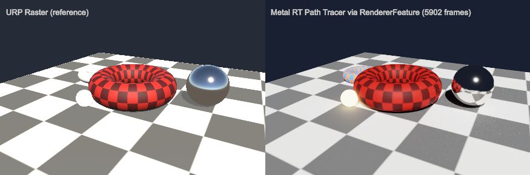

# metal-rt-test

A Mac hardware ray tracing (MetalRT) path tracer for Unity, aiming at an
HDRP-path-tracing-like feature for URP.

*Left: URP real-time rasterization. Right: the same view path traced by a
URP camera whose renderer has `MetalRTPathTracerFeature`. The checkerboard
floor uses a Shader Graph: URP rasterizes it with the graph's own shader
while the path tracer evaluates a compute shader automatically generated
from the same graph — both views match. The path traced view adds soft
shadows, GI color bleeding, emissive lighting, and mirror reflections.*

## Overview

This project verifies, step by step, that hardware ray tracing on macOS
(Apple Silicon) can cooperate with Unity — starting from building
acceleration structures out of non-readable Unity meshes, through a
progressive path tracer that consumes real URP/Lit materials inside Unity's
own Metal command stream, **conditional Shader Graph support** (material
evaluation as Unity-compiled compute shaders, generatable from Shader Graph
assets), and now **full URP integration**: the path tracer runs as a
`ScriptableRendererFeature` — add the feature to a URP renderer and any
camera using it gets path traced output, recorded through a RenderGraph
unsafe pass and composited onto the camera color target.

## Background

As of Unity 6.3 (6000.3), Unity's native ray tracing APIs
(`RayTracingAccelerationStructure`, `RayTracingShader`, inline `RayQuery`) are
not supported on Metal — `SystemInfo.supportsRayTracing` returns `false`, and
Metal support is a long-term item with no announced release. The
`UnifiedRayTracing` API falls back to a compute shader implementation on
Metal, which is not hardware ray tracing.

Therefore, the only way to use hardware ray tracing on Mac is a native plugin
that calls the Metal ray tracing APIs (`MTLAccelerationStructure` +
`metal::raytracing::intersector`) directly. That plugin is the core of this
project.

## How it works

- `NativePlugin/MetalRTPlugin.mm` — The native plugin. It obtains Unity's
  `MTLDevice` and command queue through `IUnityGraphicsMetalV2` and
  implements the ray tracing side as runtime-compiled MSL compute kernels:
  - **Acceleration structures**: per-mesh BLASes are built directly from the
    GPU buffers of non-readable Unity meshes
    (`Mesh.GetNativeVertexBufferPtr` / `GetNativeIndexBufferPtr` — no CPU
    copy of the geometry ever exists), then combined into a TLAS with
    per-instance transforms.
  - **Wavefront pipeline in phases**: the per-frame pipeline is split into
    plugin render events — Begin (TLAS rebuild + `RayGen`), then per bounce
    `Intersect` + `GeomPrep` (attribute interpolation + default URP Lit
    surface evaluation) and `Shade` (NEE + BSDF sampling), then `Resolve`
    (progressive accumulation + ACES tonemap into a Unity `RenderTexture`).
    Hit records, hit attributes, and surface records live in Unity-created
    `GraphicsBuffer`s shared with the plugin by native pointer, so **Unity
    compute shaders dispatched between Intersect and Shade can evaluate
    materials**, overwriting surface records for their material indices.
  - **URP/Lit BSDF**: Lambert diffuse + GGX specular with the URP
    metallic/smoothness convention, cosine / GGX-NDF importance sampling
    with lobe selection, and next event estimation for the directional
    light via shadow rays (intensity premultiplied by pi to match Unity's
    punctual light convention).
  - **Bindless resources** (Metal 3): mesh buffers are referenced by
    `gpuAddress` and material base maps by `gpuResourceID` from
    plain-buffer-resident tables, with explicit `useResource` residency.
  - **Render thread integration**: each phase commits Unity's current
    command buffer (`CommitCurrentCommandBuffer`) and encodes into its own
    command buffer on Unity's queue, so native kernels and Unity compute
    dispatches stay GPU-ordered on one command stream with no CPU blocking.
    (Creating encoders on Unity's own command buffer is not safe here:
    Unity's compute encoders stay open across plugin events.)
- `Assets/Editor/ShaderGraphComputeGen.cs` — The Shader Graph to compute
  shader generator. It obtains the generated shader text through
  `ShaderGraphImporter.GetShaderText` (internal API via reflection), slices
  out the `SurfaceDescriptionFunction`, its graph functions, the
  `UnityPerMaterial` cbuffer, and texture declarations, then wraps them in a
  compute kernel that maps path tracer hit attributes (UVs, world-space
  geometry, view direction, time) to `SurfaceDescriptionInputs`. Texture
  sampling macros are redefined to their LOD variants for compute. Graphs
  requiring unsupported inputs (screen position, scene color/depth, etc.)
  are rejected — this is the "conditional" support boundary.
- `Assets/Scripts/MetalRTPathTracer.cs` +
  `Assets/Scripts/MetalRTPathTracerFeature.cs` — The URP integration. The
  runtime core owns the progressive result texture, the shared wavefront
  buffers, and the material evaluation compute list, and records the phase
  pipeline into a command buffer. The renderer feature drives it from a
  RenderGraph **unsafe pass** (the same escape hatch DLSS/FSR2-style native
  integrations use): `CommandBufferHelpers.GetNativeCommandBuffer` provides
  the raw command buffer for `IssuePluginEventAndData` and the material
  dispatches, then the result is blitted onto the camera color target.
  Accumulation restarts automatically when the camera moves.
- `Assets/Scripts/PathTracerTest.cs` — The test harness. It builds a static
  URP scene at runtime; the left camera rasterizes it normally while the
  right camera uses the renderer with the path tracer feature. The floor
  uses `Assets/Shaders/TestGraph.shadergraph` (a texture-mapped Lit graph)
  rasterized by URP on the left and evaluated by its generated compute
  shader in the path tracer on the right. Material properties are bound to
  the generated compute generically from the shader's property list. A
  hand-written SurfaceDescription-style compute (`TestProcedural.compute`)
  drives the small torus as a second material evaluator.
- `Assets/Scripts/MetalRTPlugin.cs` — P/Invoke interop and the event data
  blob writer (a small ring of unmanaged blobs passes per-frame camera,
  lighting, and instance transforms to the render thread).

## Verification

Analytic tests (logged as PASS/FAIL to the console on play):

- **Probe rays**: 5 world-space rays against the TLAS with analytically
  known hit distances and instance indices.
- **T1 direct lighting**: with environment off and a single bounce, a floor
  pixel must equal `albedo/pi * lightColor * cos(theta)` where the albedo is
  the replicated checker base map sample. Measured relative error:
  **0.03 %** (native URP Lit evaluation path).
- **T2 furnace test**: a convex Lambertian sphere (albedo 0.5) in a uniform
  environment must return exactly `rho * E` (zero-variance for a convex
  body). Measured relative error: **0.00 %**.
- **T3 Unity-compiled material evaluation**: the hand-written
  SurfaceDescription-style compute shader overrides the floor material and
  must reproduce the C#-replicated procedural pattern. Measured relative
  error: **0.00 %** (validates the wavefront interop end to end).
- **T4 Shader Graph generated material**: the compute shader generated from
  `TestGraph.shadergraph` evaluates the floor and must match the
  C#-replicated base map sample times tint. The tint is changed for the
  test only — the generated compute reads material properties live while
  the native fallback keeps its setup snapshot, so the test passes only
  when the generated kernel really runs. Measured relative error:
  **0.48 %**.

All of the above run through the URP renderer feature (RenderGraph unsafe
pass), not a standalone dispatch path.

Visual verification: matching composition and shadow directions against the
URP raster reference, the Shader Graph floor matching between the raster
(graph shader) and path traced (generated compute) views, plus
path-tracing-only effects (emissive light bleed, GI color bleeding,
physically correct mirror reflections).

## How to run

1. Build the plugin: `NativePlugin/build.sh` (requires Xcode Command Line
   Tools; outputs `Assets/Plugins/macOS/libMetalRTTest.dylib`).
2. Open the project with Unity 6000.3.19f1 and enter play mode. Test results
   are logged to the console with a `[MetalRT]` prefix; a converged frame is
   saved to `Output/rt-result.png`.

Note: the macOS editor never unloads native plugins, so restart the editor
after rebuilding the plugin.

## Roadmap

- **Robustness**: broaden the supported Shader Graph input set (multiple
  UV channels, vertex color), automate generation on graph import, handle
  alpha clipping (non-opaque intersection), and support keyword variants.
- **Scene integration**: register scene meshes/materials automatically
  (renderer component scan) instead of the hand-built test scene, support
  more lights (point/spot/area), and denoise the progressive output.
